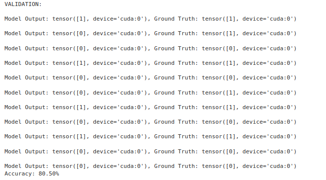

# BERTSST2

**PyTorch Implementation of BERT for SST-2 Sentiment Classification**

This repository provides a from-scratch implementation of the BERT (Bidirectional Encoder Representations from Transformers) architecture, fine-tuned on the Stanford Sentiment Treebank (SST-2) dataset for binary sentiment classification.

---

## 🔍 Overview

- **Objective**: Train and evaluate a custom BERT model on SST-2 to classify sentences as positive or negative.
- **Key Innovations**:
  - **From-Scratch Transformer Blocks**: Embedding & Positional Encoding, Multi-Head Attention, Feed-Forward Networks built manually in PyTorch.
  - **Custom WordLevel Tokenizer**: Utilizes Hugging Face’s Tokenizers library to build a whitespace-based WordLevel tokenizer.
  - **Dynamic Dataset Creation**: `DSCreator` wraps Hugging Face Datasets for flexible sequence lengths.
  - **Experiment Tracking**: Integrated with Weights & Biases (W&B) for logging metrics and hyperparameters.
  - **Modular Design**: Clean separation between data loading, model definition, training, and inference.

---

## 📦 Installation

1. **Clone the repository**
   ```bash
   git clone https://github.com/yourusername/BERTSST2.git
   cd BERTSST2
   ```

2. **Install dependencies**
   ```bash
   pip install -r requirements.txt
   ```
   _Typical dependencies include_: `torch`, `tokenizers`, `datasets`, `tqdm`, `wandb`.

---

## 🚀 Quick Start

### 1. Configure Hyperparameters

Edit hyperparameters and paths in `src/utils/config.py` (e.g., `batch_size`, `learning_rate`, `seq_len`).

### 2. Train the Model

```bash
python -m src.train
```

- Training logs, loss curves, and evaluation metrics will be automatically pushed to Weights & Biases (if configured).

### 3. Evaluate / Inference

```bash
python -m src.inference
```

- Computes validation accuracy and saves model checkpoints to the configured `weights` directory.

---

## 📈 Results

After training for __10__ epochs on SST-2, the model achieves:

- **Validation Accuracy**: __80.5%__

Some examples and the final accuracy:
<br>
<div align="center">
  
</div>
<br>

---

## 📚 References

- Devlin, J., Chang, M.-W., Lee, K., & Toutanova, K. (2019). **BERT: Pre-training of Deep Bidirectional Transformers for Language Understanding**. _NAACL_.
- Wang, A., Singh, A., Michael, J., Hill, F., Levy, O., & Bowman, S. R. (2018). **GLUE: A Multi-Task Benchmark and Analysis Platform for Natural Language Understanding**. _EMNLP_.

---

## 💡 Acknowledgments

- Thanks to the Hugging Face team for the `datasets` and `tokenizers` libraries.
- W&B for seamless experiment tracking.

